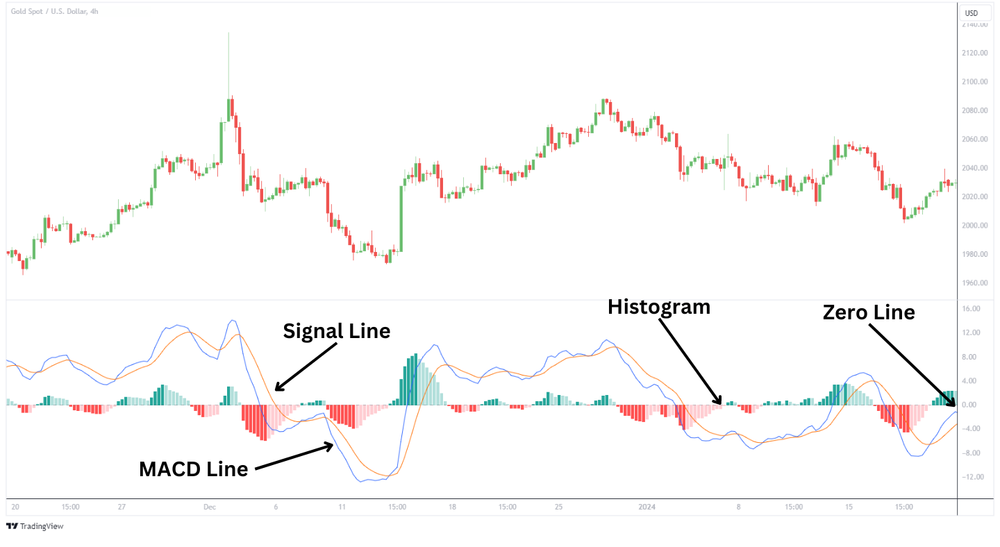
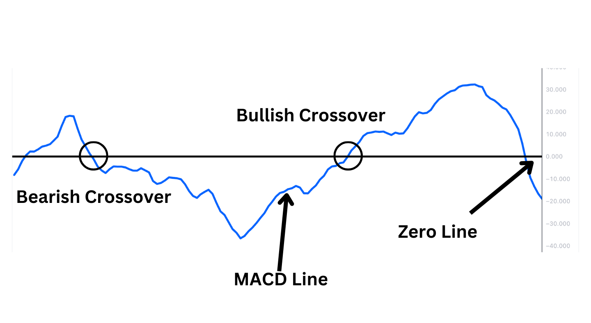
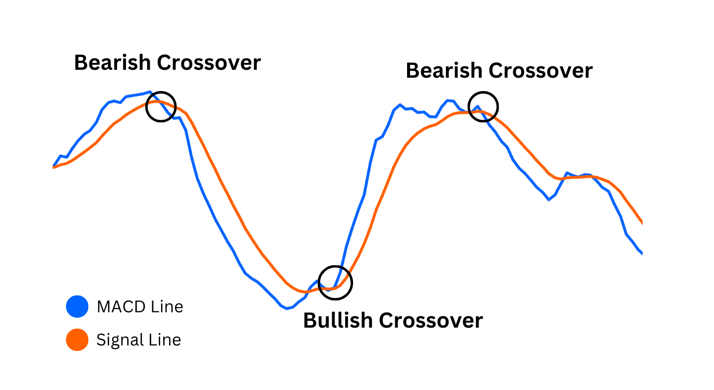
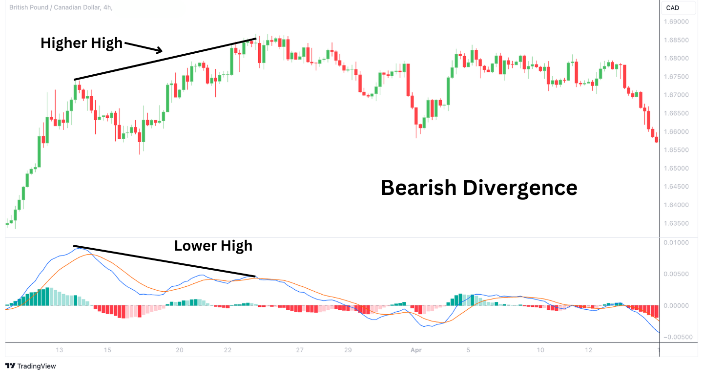
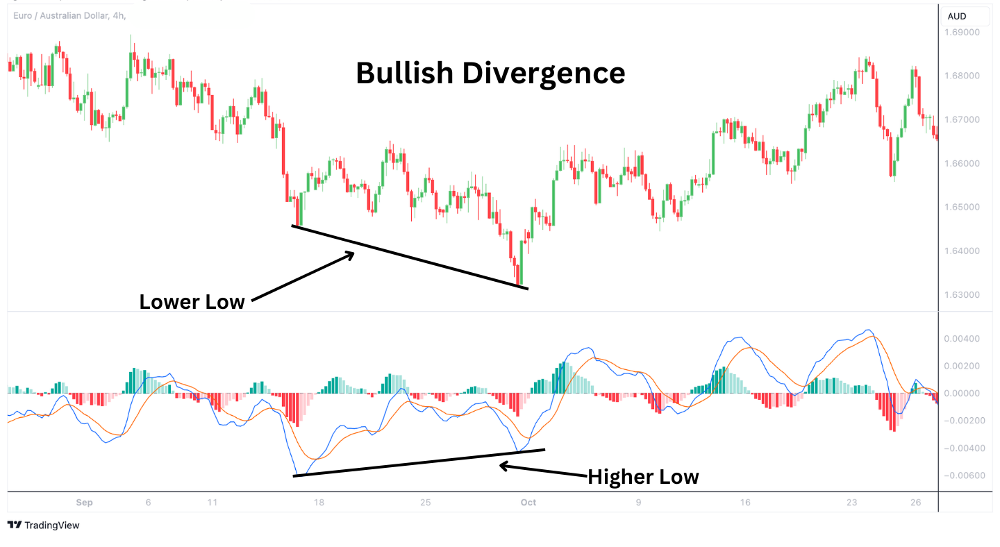

# 1M


## Idée / ToDo
- Faire un code en PinScript sur TV ou python avec td dans l'objectif de backtrader une devise en brutforcant les different paramètre (T, 12/26 (MACD), RSI) des indicateurs dans le but de trouver les réglage les plus opti
- Faire une selections des paramètre les plus intéréssant
- Faire des fonctions qui représente chaqune une stratégie d'investissement
- Découper la courbe globale en différent cycle tester les différentes stratégie
- Intégré l'API de MEXC sur le script en utilisant un testnet au debut
- Intégré MEXC 
- Monitoring tah le ouf 

## Vocabulaire 

- **Momentum** : mesure vitesse + force d'un mouvement de prix (RSI, MACD, EMA)
- **T** : Une période -> temps d'une bougie

## Indicateurs Techniques

### 1. **MACD (Moving Average Convergence Divergence)** [Cours](https://alchemymarkets.com/education/indicators/macd/)
Le MACD mesure la relation entre deux moyennes mobiles exponentielles (EMA).

#### Objectif
- Identifier des tendances
- Evalue la force et la direction des tendances.



**Ligne Zéro (Zero Line)** : Point de référence pour le momentum global : `0`

**Ligne MACD (MACD Line)** : La ligne MACD représente la différence entre deux EMA : `MACD l = EMA(12T) - EMA(26T)`

**Ligne de Signal (Signal Line)** : La ligne de signal est une EMA sur 9 jours appliquée à la ligne MACD. : `Signal l = EMA(9 MACD)`

**Histogramme** :  Représente plus visuellement la différence entre la ligne MACD et la ligne de signal : `Hist = MACD Line - Signal Line`


Divergences : Des divergences entre l'histogramme et l'action des prix peuvent signaler des inversions ou des continuations de tendance.


#### Interprétation fumeuse du marabout de la finance
Signal                | Signification
----------------------|----------------
MACD > 0              | tendance 📈
MACD < 0              | tendance 📉



Signal                             | Signification
-----------------------------------|----------------
Croisement MACD/Signal vers le ↗️   | Signal d’achat
Croisement MACD/Signal vers le ↘️   | Signal de vente



#### Divergence

**Divergence baissière** : If prix au + ↗️ and histogrammepics + ↘️ : affaiblissement de la tendance 📈 + risque de retournement 📉.


**Divergence haussière**: If le prix au + ↘️ and l’histogramme + ↗️ : ralentissement de la tendance 📉 + possible retournement 📈



#### Exemple en Python :

[Python MACD Testing : matplotlib + yfinance](CassageDeFront/MACD/MACD.py)


#### Trading View

```Pinescript
//@version=6
indicator("MACD #2")
fastInput = input(12, "Fast length")
slowInput = input(26, "Slow length")
[macdLine, signalLine, histLine] = ta.macd(close, fastInput, slowInput, 9)
plot(macdLine, color = color.blue)
plot(signalLine, color = color.orange)
```
=
```Pinescript
//@version=6
indicator("MACD #1")
fast = 12
slow = 26
fastMA = ta.ema(close, fast)
slowMA = ta.ema(close, slow)
macd = fastMA - slowMA
signal = ta.ema(macd, 9)
plot(macd, color = color.blue)
plot(signal, color = color.orange)
```

---

### 2. **EMA (Exponential Moving Average)**
$$
EMA_{today} = Price_{today} \cdot \alpha + EMA_{yesterday} \cdot (1 - \alpha)
$$

avec :

$$
\alpha = \frac{2}{T+1} \quad \text{(où } T \text{ est la période, c'est-à-dire la durée d'une bougie).}
$$

L'EMA est une moyenne mobile qui donne plus de poids aux données récentes, la rendant plus sensible aux variations récentes.


#### Interprétation :
- Réagit rapidement aux changements de prix récent.
- Utile pour détecter des inversions de tendance à court terme.

---

### 3. **SMA (Simple Moving Average)**
La SMA est une moyenne simple des prix sur une période donnée.

#### Formule :
$SMA = \frac{P_1 + P_2 + \dots + P_N}{N}$

avec :
- $P_i$ : Prix à chaque intervalle.
- $N$ : Nombre de périodes.

#### Interprétation :
- Moins sensible aux variations soudaines.
- Utilisée pour identifier des tendances générales.

---

### 4. **WMA (Weighted Moving Average)**
La WMA attribue des poids décroissants aux valeurs passées pour donner plus d'importance aux prix récents.

#### Formule :
$WMA = \frac{P_1 \cdot W_1 + P_2 \cdot W_2 + \dots + P_N \cdot W_N}{W_1 + W_2 + \dots + W_N}$

avec :
- $W_i = i$ (pondération linéaire croissante).


#### Interprétation :
- Utile pour suivre les tendances avec une réactivité modérée.
- Plus réactive que la SMA mais plus stable que l'EMA.

---


## Article 
- [385% indicator](https://freedium.cfd/https://medium.com/limitless-investor/358-return-per-trade-i-created-an-indicator-that-will-change-your-trading-forever-69824d8d0de3)
- [Algo trading](https://freedium.cfd/https://ai.gopubby.com/from-finance-papers-to-trading-algorithms-an-automated-approach-ccd2180ee306)
- [AI automated trading](https://freedium.cfd/https://sonnyhuynhb.medium.com/how-i-made-my-own-automated-trading-system-with-ai-and-nocode-5d82cb78bd9c)
- [?????](https://www.cryptodatadownload.com/blog/posts/nr4-range-contraction-trading-strategy-python/)
- [Trading View : Pine Scripting](https://www.tradingview.com/pine-script-docs/primer/first-indicator/#first-version)
